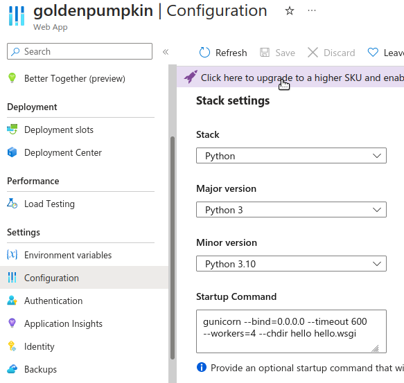

# README

## Add a startup command

This is following the suggestion in [Example startup commands](https://learn.microsoft.com/en-us/azure/app-service/configure-language-python#example-startup-commands)

```
# <module-path> is the relative path to the folder that contains the module
# that contains wsgi.py; <module> is the name of the folder containing wsgi.py.
gunicorn --bind=0.0.0.0 --timeout 600 --workers=4 --chdir <module_path> <module>.wsgi
gunicorn --bind=0.0.0.0 --timeout 600 --workers=4 --chdir hello hello.wsgi
```



## ALLOWED_HOSTS warning

Ignore warning like that shown below. Actually when this warning is showing, it means the app deployment is running successfully.

```
2024-06-28T09:57:44.8286114Z django.core.exceptions.DisallowedHost: Invalid HTTP_HOST header: '169.254.129.7:8000'. You may need to add '169.254.129.7' to ALLOWED_HOSTS.
```

In `DEBUG` mode, set   `ALLOWED_HOSTS=localhost'.

## Key vault usage

In the environment, specify the key like this:

`@Microsoft.KeyVault(VaultName:<my_vault_name>;SecretName:<my_secret_name_in_the_vault>)

## Environment variables

```
ALLOWED_HOSTS=<my_app_name>.azurewebsites.net
DEBUG=true
DISABLE_COLLECTSTATIC=false
PRE_BUILD_COMMAND=echo Pre-build command
POST_BUILD_COMMAND=echo Post-build command
SCM_DO_BUILD_DURING_DEPLOYMENT=true
SECRET_KEY=@Microsoft.KeyVault(VaultName:<my_vault_name>;SecretName:<my_secret_name_in_the_vault>)
SQL_DRIVER=ODBC Driver 18 for SQL Server
SQL_SERVER=<my_sql_server_name>.database.windows.net
SQL_NAME=<my_sql_database_name>
SQL_USER=<sql_username>
SQL_PASSWORD=<sql_password>
WEBSITE_HTTPLOGGING_RETENTION_DAYS=3
```

## To use this template

Change the name `hello` to the name of a new app.

Reference repository for future:
- `green-engine`: The Django template from Codespaces.
- `purple-potato`: Creating REST API with Python, Django and Azure SQL. The sample from Microsoft Learn.
- `singing_cricket`: This repository combines the features from both the Django template and the REST API examples.

## Notes on create a new repository

```
echo "# singing_cricket" >> README.md
git init
git add README.md
git commit -m "first commit"
git branch -M main
git remote add origin https://github.com/liewchooichin/singing_cricket.git
git push -u origin main
```

